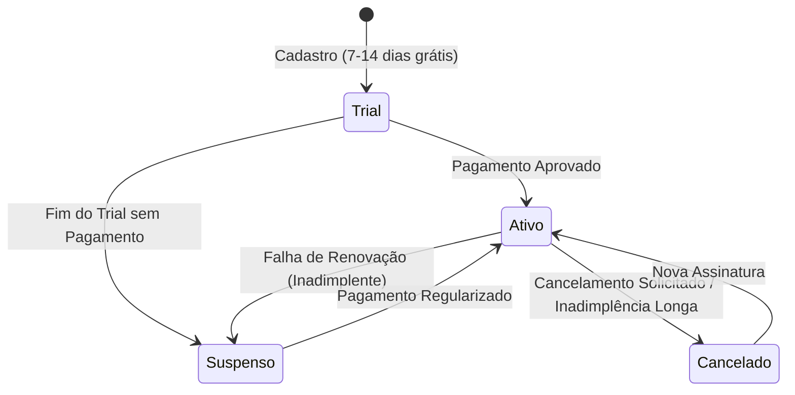

# Etapa 5: Integração de Cobranças e Assinaturas (Stripe / Asaas)

Esta etapa descreve a integração de faturamento automatizado via gateways de pagamento (como Stripe ou Asaas) no modelo SaaS, detalhando a sincronização de planos e estados de bloqueio no banco de dados via webhooks.

---

## 1. Fluxo de Contratação e Ciclo de Vida da Assinatura

O ciclo de vida da assinatura no SaaS segue o seguinte diagrama de estados:



---

## 2. Configuração do Gateway e Geração do Checkout

Quando a profissional decide contratar o plano ou gerenciar seu faturamento no painel administrativo:
1. O frontend chama uma rota ou Edge Function do Supabase para criar uma **Sessão de Checkout** (Checkout Session) no Stripe.
2. É obrigatório passar o `estabelecimento_id` no campo `client_reference_id` da sessão do Stripe para podermos identificar de quem é o pagamento no retorno do webhook:
   ```typescript
   // Exemplo de criação de sessão no Stripe (Node.js / Edge Function)
   const session = await stripe.checkout.sessions.create({
     payment_method_types: ['card', 'pix'],
     line_items: [{ price: 'ID_DO_PRECO_PREMIUM', quantity: 1 }],
     mode: 'subscription',
     client_reference_id: establishmentId, // Conexão direta com o banco SaaS
     success_url: 'https://meusite.com/dashboard/faturamento?success=true',
     cancel_url: 'https://meusite.com/dashboard/faturamento?cancel=true',
   });
   ```

---

## 3. Criação do Endpoint de Webhooks (Supabase Edge Function)

Desenvolveremos uma Edge Function no Supabase (em `/supabase/functions/stripe-webhook/index.ts`) para escutar os eventos enviados pelo gateway.

### Eventos Críticos a Tratar (Exemplo Stripe):

1. **`checkout.session.completed`**:
   - Disparado no primeiro pagamento com sucesso.
   - Ação: Ler o `client_reference_id` e atualizar a tabela `estabelecimentos` com `status_assinatura = 'ativo'`, `plano = 'premium'` e salvar os IDs da assinatura do Stripe (`stripe_customer_id` e `stripe_subscription_id`).

2. **`invoice.paid`**:
   - Disparado em cada renovação mensal bem-sucedida.
   - Ação: Garantir que o `status_assinatura` na tabela `estabelecimentos` esteja definido como `'ativo'`.

3. **`invoice.payment_failed`** ou **`customer.subscription.updated`**:
   - Disparado quando a cobrança recorrente falha após várias tentativas, ou quando a assinatura entra em atraso.
   - Ação: Atualizar `status_assinatura` para `'suspenso'`.

### Exemplo de Código da Edge Function (Conexão Direta ao Banco via Client SQL):
```typescript
import { createClient } from 'https://esm.sh/@supabase/supabase-js@2';
import Stripe from 'https://esm.sh/stripe@12';

const stripe = new Stripe(Deno.env.get('STRIPE_SECRET_KEY')!, { apiVersion: '2022-11-15' });

Deno.serve(async (req) => {
  const signature = req.headers.get('stripe-signature')!;
  const body = await req.text();

  // 1. Validar assinatura do webhook por segurança
  let event;
  try {
    event = stripe.webhooks.constructEvent(body, signature, Deno.env.get('STRIPE_WEBHOOK_SECRET')!);
  } catch (err) {
    return new Response(`Webhook Error: ${err.message}`, { status: 400 });
  }

  // 2. Conectar ao banco usando chaves do sistema (Service Role para bypass de RLS)
  const supabase = createClient(
    Deno.env.get('SUPABASE_URL')!,
    Deno.env.get('SUPABASE_SERVICE_ROLE_KEY')!
  );

  const session = event.data.object;

  if (event.type === 'checkout.session.completed') {
    const establishmentId = session.client_reference_id;
    
    // Atualizar no banco
    await supabase
      .from('estabelecimentos')
      .update({
        status_assinatura: 'ativo',
        plano: 'premium'
      })
      .eq('id', establishmentId);
  }
  
  // Tratar outros eventos (invoice.paid, invoice.payment_failed, etc.)

  return new Response(JSON.stringify({ received: true }), { status: 200 });
});
```

---

## 4. Tela de Bloqueio Administrativo (Faturamento Atrasado)

Se a assinatura do estúdio for alterada para `'suspenso'` ou `'cancelado'`:
1. No arquivo `src/App.tsx`, configuraremos um componente de proteção de dashboard (ex: `BillingGuard`).
2. Se o status retornado pelo contexto for diferente de `trial` ou `ativo`, a profissional será forçada a visualizar uma tela bloqueada:
   - *"Assinatura Suspensa: Não foi possível processar o pagamento de renovação do seu plano. Regularize seus dados de faturamento para reestabelecer o acesso."*
3. Nesta tela, existirá um botão que abre o **Customer Portal do Stripe** para que ela insira uma forma de pagamento válida e pague o saldo pendente, reativando a conta instantaneamente via webhook.

---

## 5. Plano de Testes

1. **Simular Compra com Sucesso**:
   - Usar a ferramenta Stripe CLI para disparar webhooks simulados localmente:
     ```bash
     stripe trigger checkout.session.completed --payload ...
     ```
   - Confirmar se a linha correspondente do estúdio no banco de dados foi promovida a `ativo` e `premium`.
2. **Simular Falha de Pagamento (Bloqueio)**:
   - Disparar o webhook de falha (`invoice.payment_failed`).
   - Confirmar se o estúdio foi para `suspenso`.
   - Fazer login com a conta profissional desse estúdio e garantir que ela é direcionada para a tela de bloqueio, impedindo-a de acessar clientes ou agendamentos até que o pagamento seja processado.
